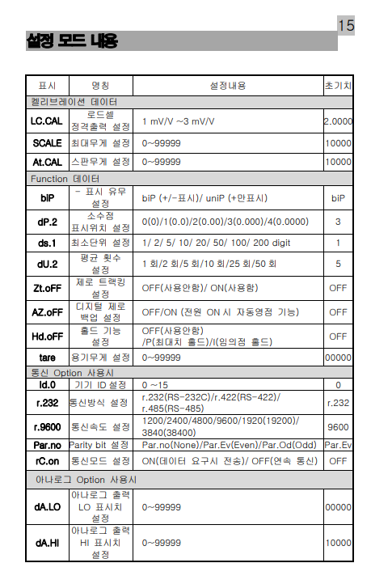
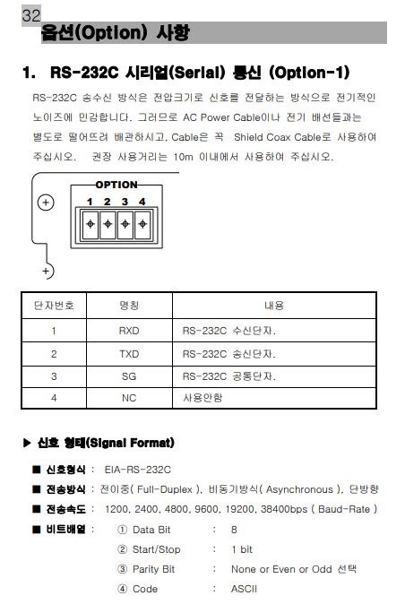
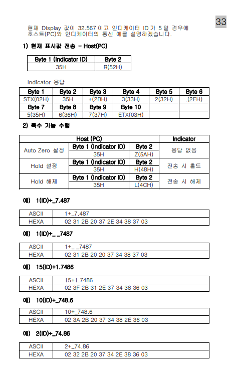
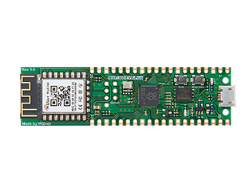
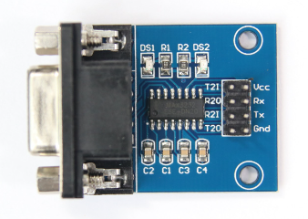
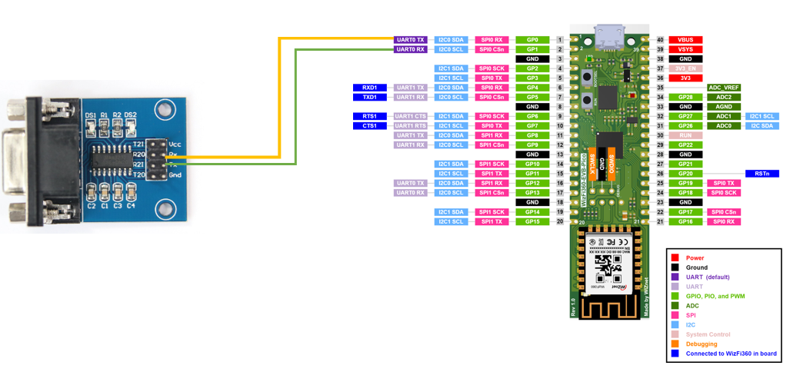

### Bs205 Setup  
https://www.youtube.com/watch?v=98AfvAG5bKc

### Setting for this example  
- id : 5 (Not use for data parse)
- Baud-Rate : 9600 
- parity : None
- rC.on : OFF (continuous commuication)

### RS232 Docs  

### Use device  
- Wizfi360-evo-pico  

- RS232 to TTL module  

### circuit diagram

`Connect only Rx and Tx. Don't supply power to RS232TTL module.`

