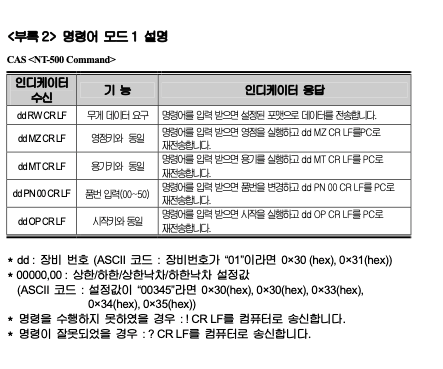
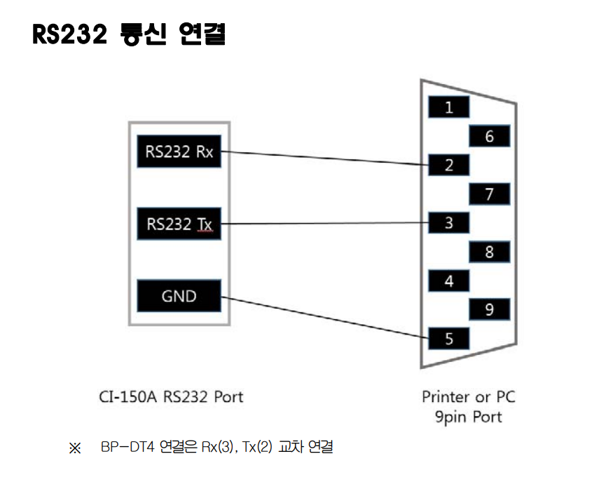

comm 1 -> 0 장비번호 0.  
comm 2 -> 0 데이터 8비트 스톱 1비트 패리티비트 none.  
comm 3 -> 3 9600bps.  
comm 4 -> 0 표시값을 송신.  
comm 5 -> 0 카스의 22바이트.  
comm 6 -> 4 커맨드 모드 1번.  
 

데이터 요청 HEX
영점 조절  0x30 0x30 0x4D 0x5A 0x0D 0x0A
데이터 요청 0x30 0x30 0x52 0x57 0x0D 0x0A

http://192.168.0.190/hex?message=30304D5A0D0A

http://192.168.0.190/hex?message=303052570D0A
http://192.168.0.190/hex?message=30304D5A0D0A

http://192.168.0.190/hex?message=303052570D0A

